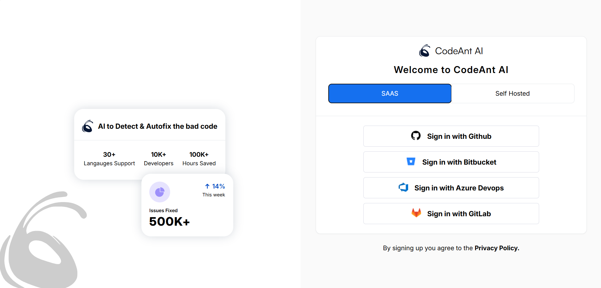
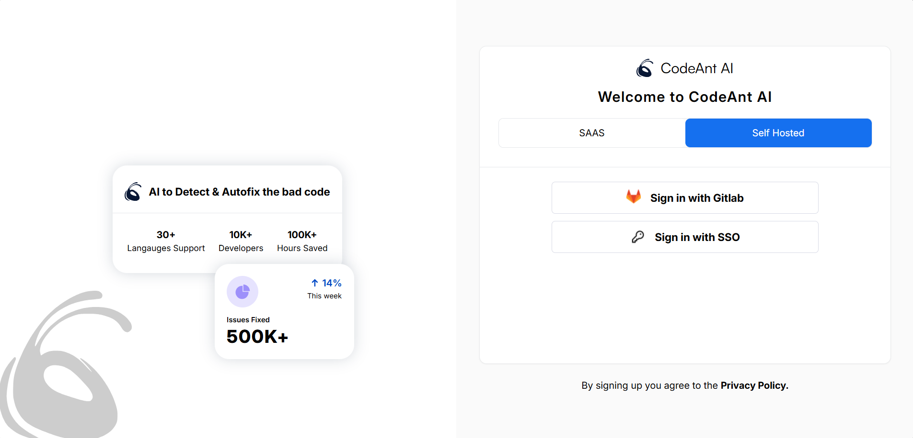
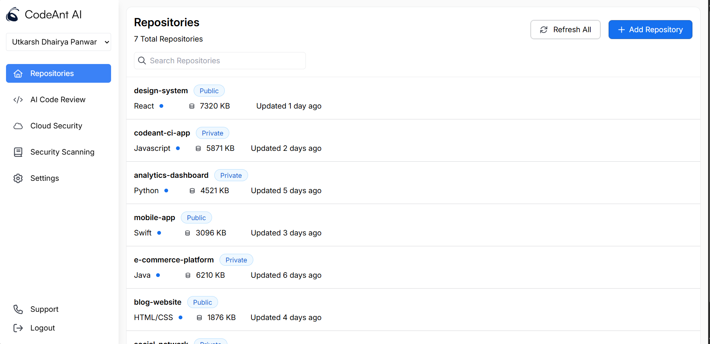
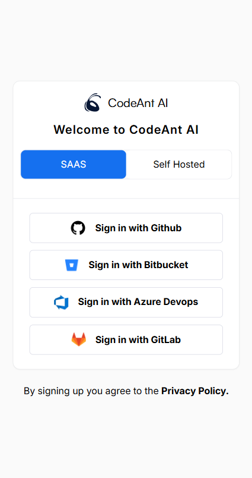
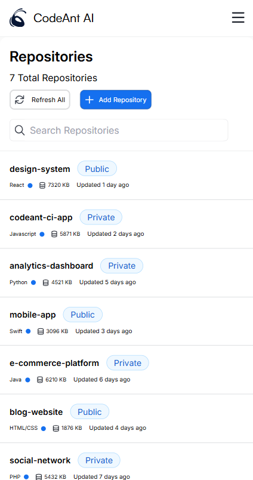
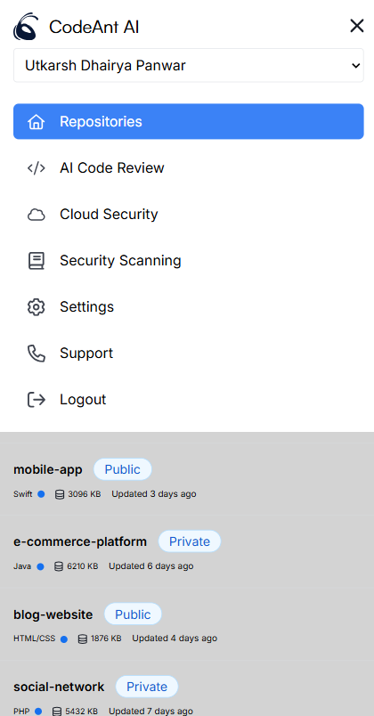

---

# Codeant AI Frontend Assignment

This repository contains the frontend assignment developed for Codeant AI. The application is built using **React** with **Vite** as the bundling tool and styled using **Tailwind CSS**. For performance, SVGs are used for icons, and the code is structured into logical folders for scalability and maintainability.

## Features

- **Component-based Architecture**: Code structured into `components`, `pages`, and `constants` for better readability and reusability.
- **Performance Optimization**:
  - **React.memo** for optimizing component re-renders.
  - **useCallback** and **useMemo** hooks for efficient state and prop handling.
- **SVG Icons**: Lightweight and performance-optimized icons.
- **Modern Development Setup**: Uses Vite for fast bundling and hot module replacement.

<p align="center">
  
  
  
  
  
  

</p>

## Project Structure

```
src/
├── components/    # Reusable UI components
├── pages/         # Main application pages
├── constants/     # Constant data used across the app
├── assets/        # Static assets like SVG icons
├── App.jsx        # Application root
├── main.jsx       # Vite entry point
├── index.css      # Tailwind CSS configuration
```

## Prerequisites

Ensure you have the following installed on your system:

- **Node.js** (v14 or above)
- **npm** or **yarn**

## Installation

1. Clone the repository:
   ```bash
   git clone <repository-url>
   cd <repository-folder>
   ```

2. Install dependencies:
   ```bash
   npm install
   ```
   Or, if you use Yarn:
   ```bash
   yarn
   ```

3. Start the development server:
   ```bash
   npm run dev
   ```
   Or with Yarn:
   ```bash
   yarn dev
   ```

4. Open the app in your browser:
   Visit [http://localhost:5173](http://localhost:5173) to view the application.

## Build for Production

To create a production build:

```bash
npm run build
```
Or with Yarn:

```bash
yarn build
```

The build files will be available in the `dist` folder.

## Scripts

- **`npm run dev`**: Start the development server.
- **`npm run build`**: Build the application for production.
- **`npm run preview`**: Preview the production build locally.

## Key Technologies

- **React**: Frontend library for building the user interface.
- **Vite**: Blazing-fast bundler and development server.
- **Tailwind CSS**: Utility-first CSS framework for styling.
- **SVG Icons**: Used for performance and scalability.
- **React.memo, useCallback, useMemo**: Optimizations for rendering and state management.

## License

This project is licensed under the MIT License. See the [LICENSE](LICENSE) file for details.

---

Feel free to customize this README file to fit your needs!
